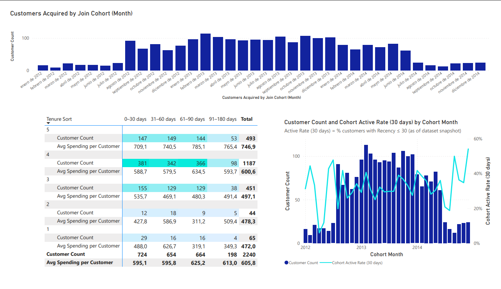
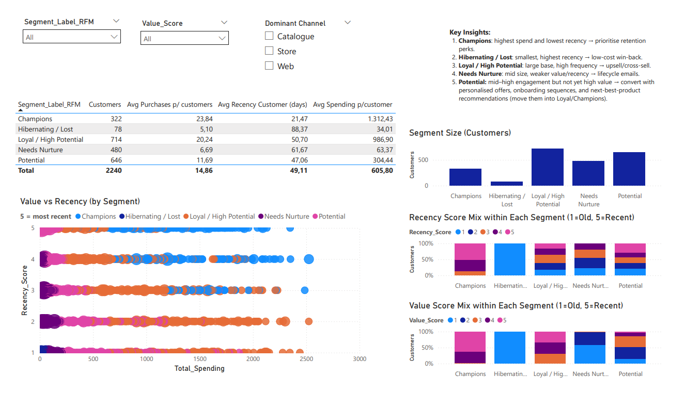
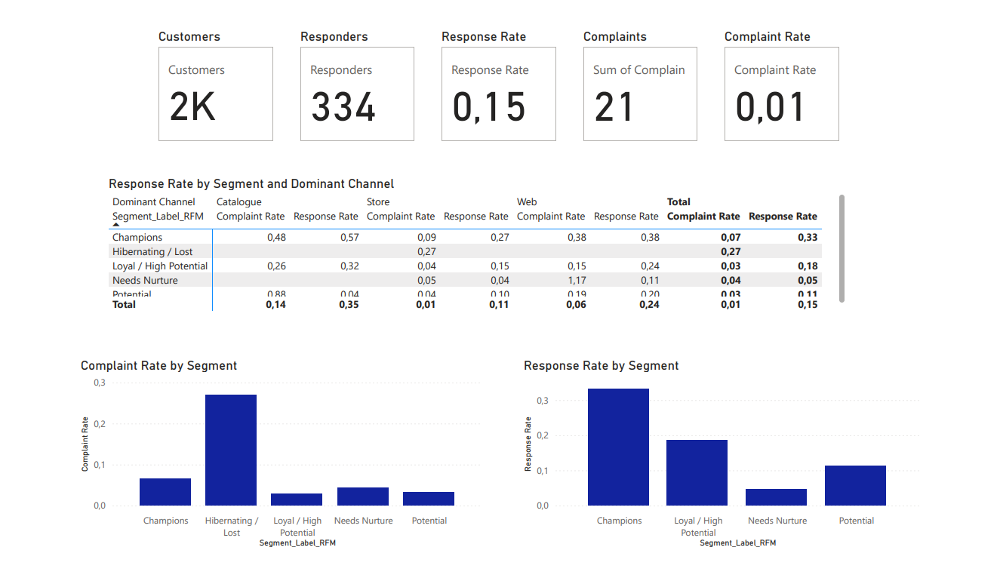
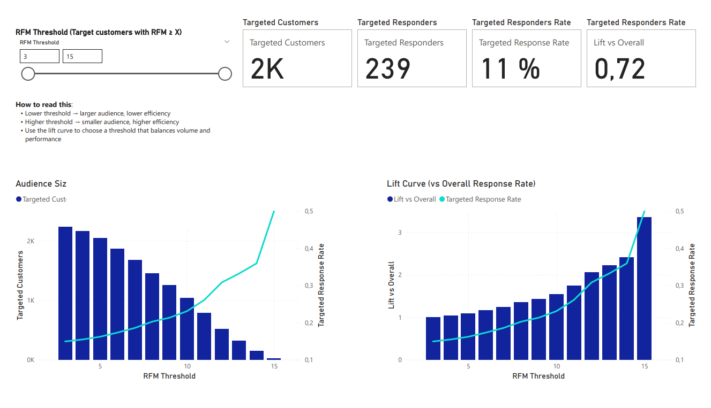

# Power BI — RFM Threshold Optimiser (CRM Targeting)

This Power BI dashboard supports CRM targeting decisions by balancing audience size vs response performance using an RFM threshold and lift-style evaluation.

## Business question
What is the optimal RFM threshold for targeting, given the trade-off between reach (audience size) and performance (response rate / lift)?

## What the dashboard includes
- **Threshold selector:** evaluate multiple RFM cut-offs
- **Coverage vs performance:** show how audience shrinks as performance improves
- **Lift-style views:** compare targeted vs baseline response rates
- **Actionable guidance:** recommended threshold ranges for different CRM goals (efficiency vs scale)

## Key outputs
- **PDF walkthrough (published):**  
  `https://valescabravo.github.io/reports/CRM_Analytics_Portfolio.pdf`

## Notes
- The PDF is the stakeholder-ready deliverable published in my portfolio site.
- This repository is supporting evidence (documentation and assets). The PBIX file can be shared on request if needed.

## Screenshots

